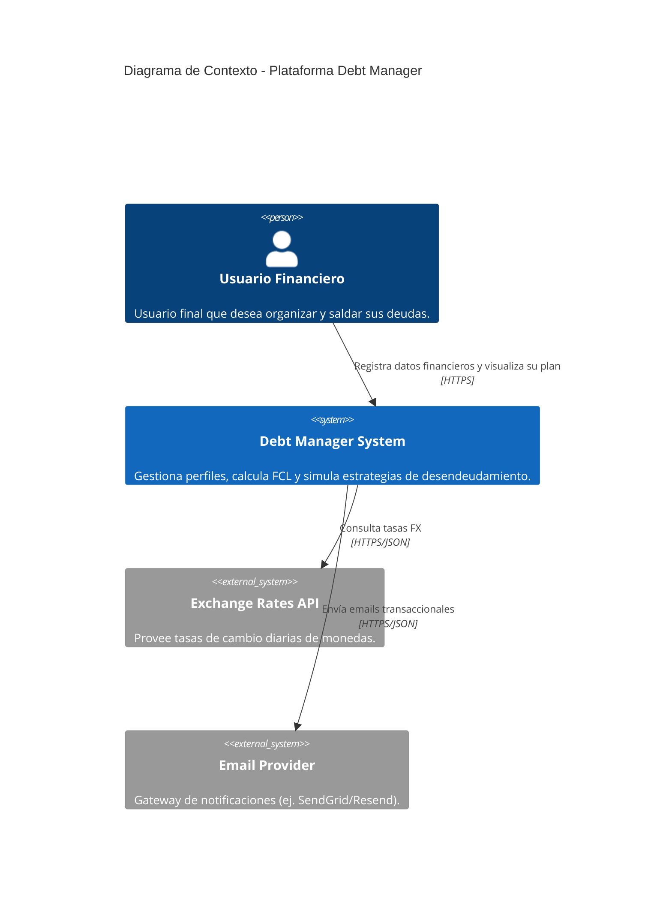
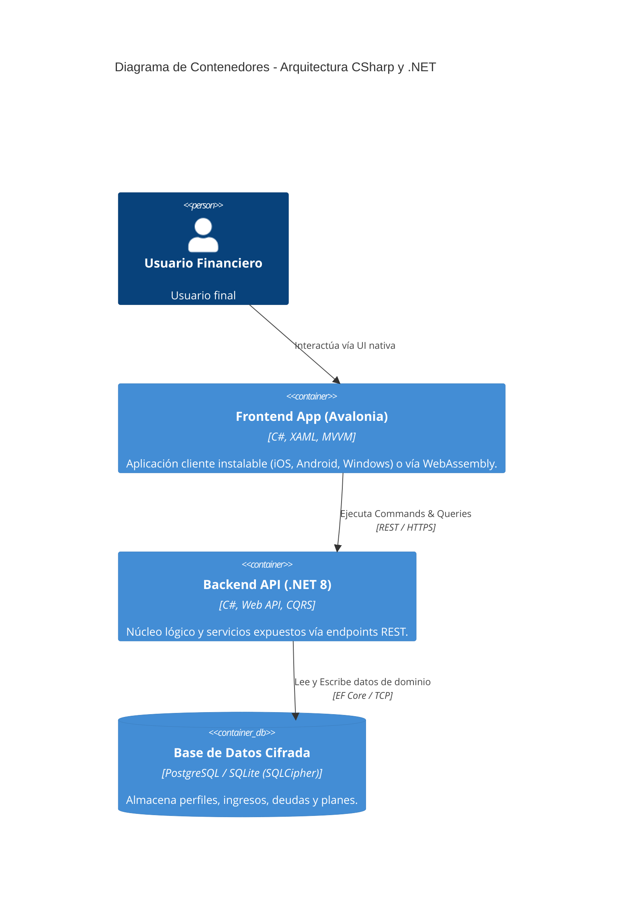

# Diagramas de Arquitectura (C4 Model)

Este documento centraliza los diagramas C4 usando la sintaxis de Mermaid para integrarse nativamente en repositorios de GitHub/GitLab.

## Nivel 1: Diagrama de Contexto

## Nivel 2: Diagrama de Contenedores

