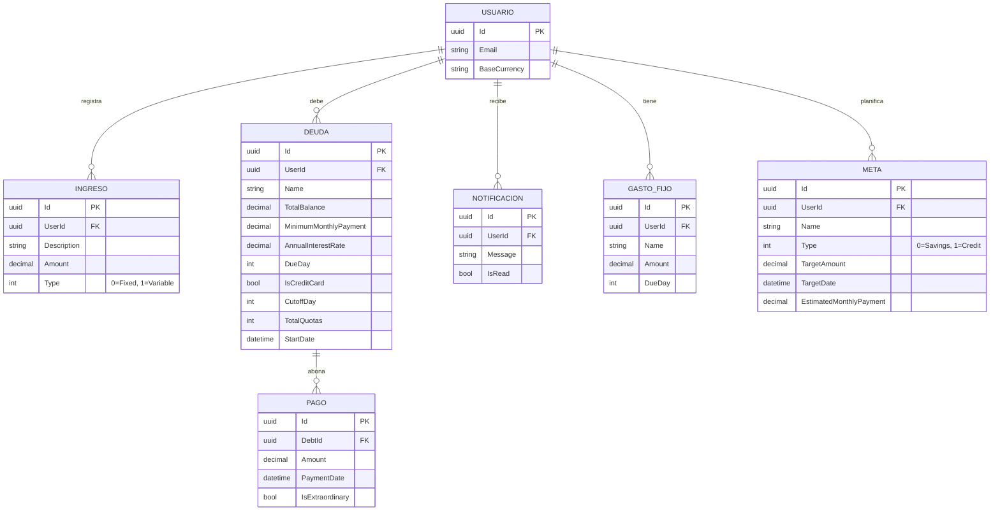

# Modelo Entidad-Relación (ERD)

Este es el modelo de datos núcleo relacional, optimizado para ser orquestado mediante Entity Framework Core, respetando la 3ra Forma Normal. Incluye las actualizaciones de la Fase 2 (Control Exhaustivo) y Fase 3 (Asesor Financiero).

