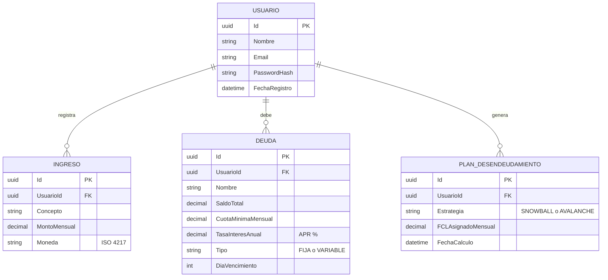

# Modelo Entidad-Relación (ERD)

Este es el modelo de datos núcleo relacional, optimizado para ser orquestado mediante Entity Framework Core, respetando la 3ra Forma Normal.

```mermaid
erDiagram
    USUARIO {
        uuid Id PK
        string Nombre
        string Email
        string PasswordHash
        datetime FechaRegistro
    }
    
    INGRESO {
        uuid Id PK
        uuid UsuarioId FK
        string Concepto
        decimal MontoMensual
        string Moneda "ISO 4217"
    }
    
    DEUDA {
        uuid Id PK
        uuid UsuarioId FK
        string Nombre
        decimal SaldoTotal
        decimal CuotaMinimaMensual
        decimal TasaInteresAnual "APR %"
        string Tipo "FIJA o VARIABLE"
        int DiaVencimiento
    }
    
    PLAN_DESENDEUDAMIENTO {
        uuid Id PK
        uuid UsuarioId FK
        string Estrategia "SNOWBALL o AVALANCHE"
        decimal FCLAsignadoMensual
        datetime FechaCalculo
    }

    %% Relaciones Principales
    USUARIO ||--o{ INGRESO : registra
    USUARIO ||--o{ DEUDA : debe
    USUARIO ||--o{ PLAN_DESENDEUDAMIENTO : genera
```
